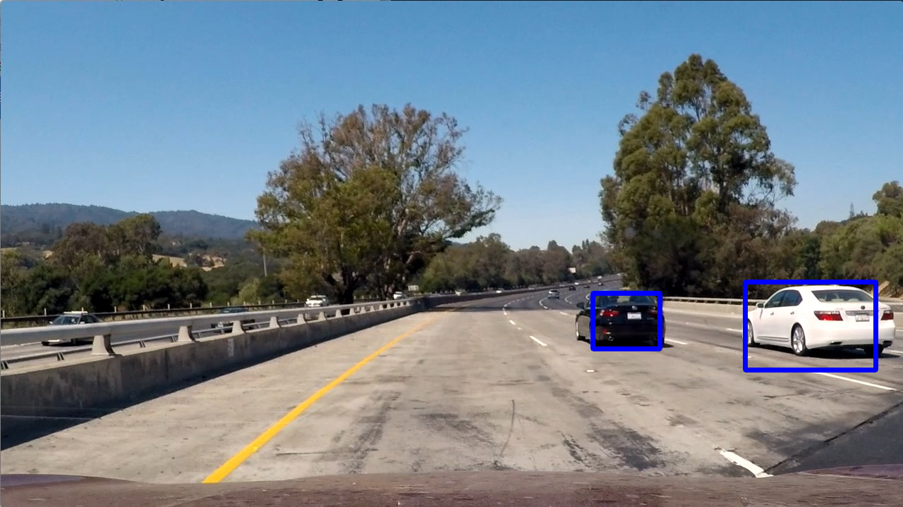

# Project: Vehicle Detection and Tracking
## My 5th Project in the Self-Driving Car Engineer Nanodegree at [Udacity](https://www.udacity.com/)



### Link to the Udacity project repository

https://github.com/udacity/CarND-Vehicle-Detection

### Project Overview
In this project, I wrote a software pipeline to detect vehicles in a [video](https://drive.google.com/open?id=0B0agIiDyIPj1aDJYWmVNSjRPMUU).

### Output video

The project outputs a video in which the detected vehicles are marked with a blue rectangle. The output video can be watched [here](https://drive.google.com/open?id=0B0agIiDyIPj1aDJYWmVNSjRPMUU).

### Install

This project requires **Python 3.5** and the following Python libraries installed:

- [NumPy](http://www.numpy.org/)
- [matplotlib](http://matplotlib.org/)
- [scikit-image](http://scikit-image.org/)
- [scikit-learn](http://scikit-learn.org/)
- [SciPy](https://www.scipy.org/)
- [OpenCV](http://opencv.org/)
- [MoviePy](http://zulko.github.io/moviepy/)

You will also need to have software installed to run and execute a [Jupyter Notebook](http://jupyter.org/)

### Run

In order to run the code in the jupyter notebook you also need the file [**project_video.mp4**](https://github.com/udacity/CarND-Vehicle-Detection/blob/master/project_video.mp4) as well as the [test images](https://github.com/udacity/CarND-Vehicle-Detection/tree/master/test_images) from the [Udacity project repository](https://github.com/udacity/CarND-Vehicle-Detection).

Load the file with jupyter notebook using the following command:

```jupyter notebook CarND-Vehicle-Detection.ipynb```
